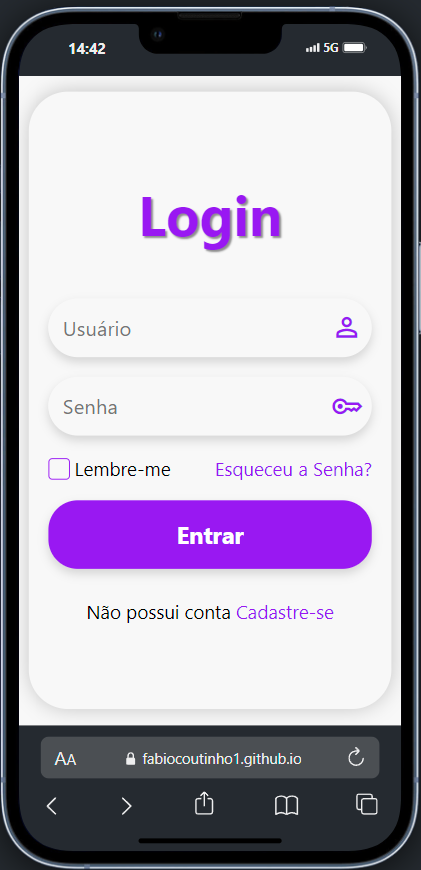

# Tela de Login Responsiva

Este projeto consiste em uma tela de login responsiva desenvolvida com HTML e CSS. A tela é projetada para ser visualmente atraente e funcional em diferentes tamanhos de tela e dispositivos. Desenvolvida em mobile first.

## Visão Geral

A tela de login inclui:

* Campos para nome de usuário e senha.
* Botão de login.
* Design responsivo que se adapta a diferentes tamanhos de tela (desktops, 
  tablets e smartphones).

  ## Exemplos
  
   
  
  # [Va para o site](https://fabiocoutinho1.github.io/tela-de-login/)
  

  ## Estrutura do Projeto

  /tela-login-responsiva
│
├── index.html
├── media-query.css
├── style.css
└── README.md

* index.html: Contém o código HTML da tela de login.
* media-query: Contém o código CSS para fazer a Responsividade
* style.css: Contém o código CSS para estilizar a tela de login.
* README.md: Este arquivo com informações sobre o projeto.

## Instalação

1. Clone este repositório para sua máquina local usando o comando:
   ```bash
   git clone https://github.com/FabioCoutinho1/tela-de-login
2. Navegue para o diretório do projeto:
    ```bash
    cd tela-de-login
3. Abra o arquivo index.html em um navegador de sua escolha.

## Tecnologias Utilizadas

A tela de login é projetada para se ajustar a diferentes tamanhos de tela usando:

* **Media Queries**: Para ajustar o layout em dispositivos móveis e desktops.
* **Flexbox**: Para alinhar e distribuir o espaço entre os elementos da tela de login.

## Personalização
Você pode personalizar a tela de login modificando os seguintes elementos no arquivo style.css:

* **Cores**: Ajuste as cores de fundo, texto e botões.
* **Fonte**: Modifique as fontes e tamanhos de texto.
* **Layout**: Altere o layout e o espaçamento dos elementos conforme necessário.

## Contribuições

Se você quiser contribuir para este projeto, fique à vontade para abrir uma issue ou enviar um pull request. Seu feedback e sugestões são bem-vindos!

1. Faça um fork deste repositório.
2. Crie uma nova branch (`git checkout -b feature/nova-funcionalidade`).
3. Faça as suas alterações e commit (`git commit -am 'Adiciona nova funcionalidade'`).
4. Envie a branch para o repositório (`git push origin feature/nova-funcionalidade`).
5. Crie um pull request.

Por favor, siga o [Guia de Contribuição](docs/CONTRIBUTING.md) para mais detalhes.

## Contato

Se você tiver alguma dúvida ou feedback, sinta-se à vontade para entrar em contato comigo:

- Nome: Fabio Coutinho
- Email: fabiofarias549@gmail.com